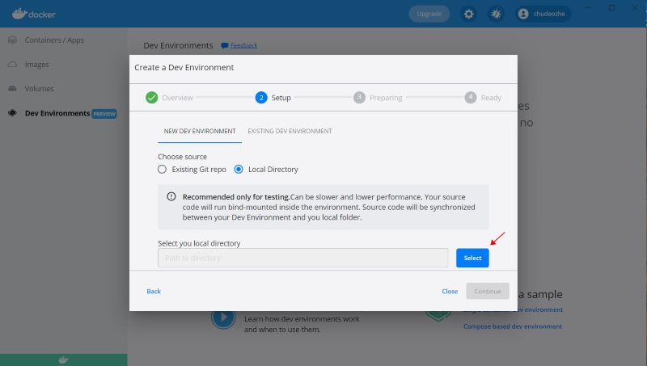
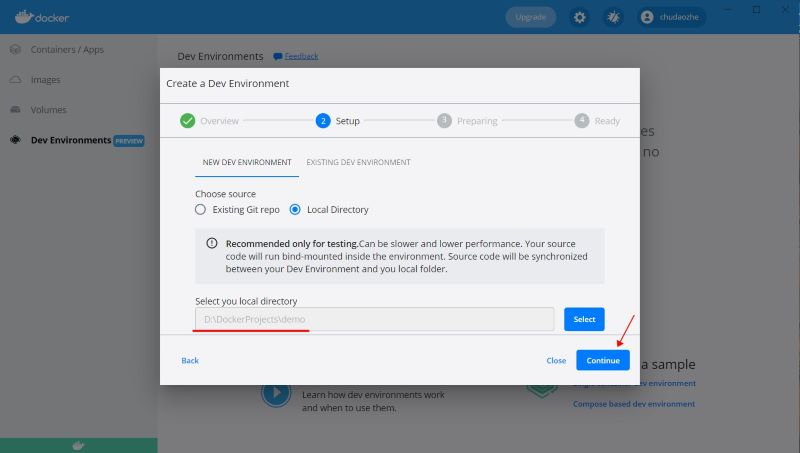
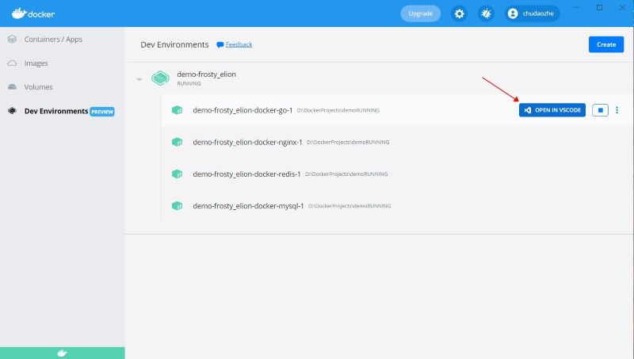
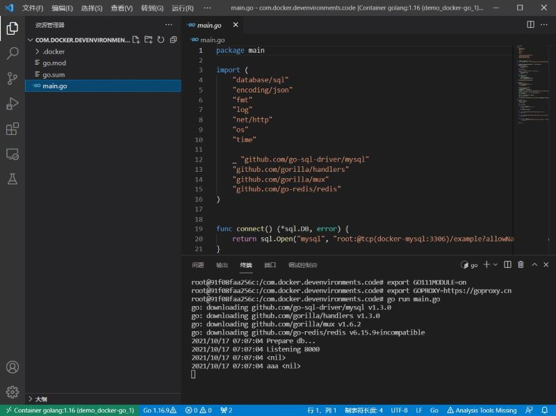
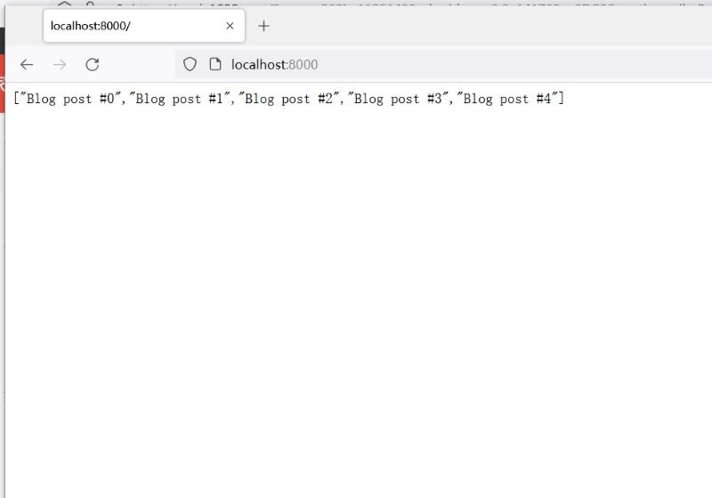

# 说明
etc下面是配置文件，包括redis,mysql,nginx

如果不用域名，nginx可以不用

# 使用
目录结构
```
├── demo
├── dev-environment-go
```
如上，`demo`是一个go项目的目录

1. 复制`docker-compose.yaml`文件到`demo/.docker/`目录
   ```
   cp dev-environment-go/docker-compose.yaml demo/.docker/
   ```
2. 使用Docker Desktop打开`demo`目录

Docker Desktop默认会把`demo`下的所有文件挂载到容器内部目录`/com.docker.devenvironments.code`

# sample
连接mysql
```
sql.Open("mysql", "root:@tcp(docker-mysql:3306)/example")
```

连接redis
```
redis.NewClient(&redis.Options{Addr:"docker-redis:6379", Password:"", DB:0,})
```
# 相关文章
[使用Docker Desktop快速搭建Go开发环境](http://www.cuiwei.net/p/1646892571)

# 截图




